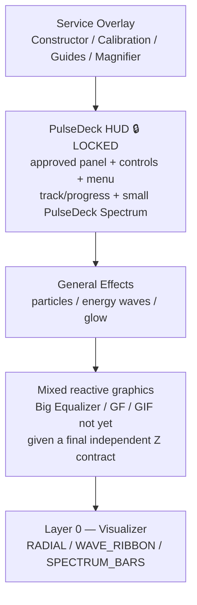
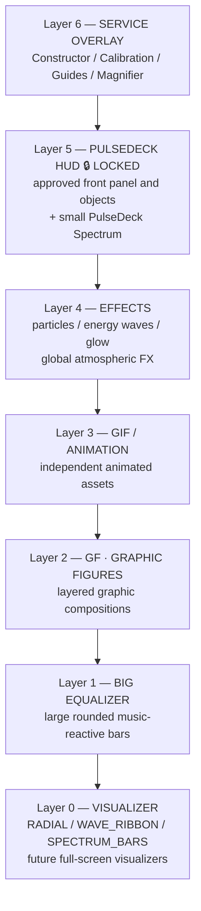
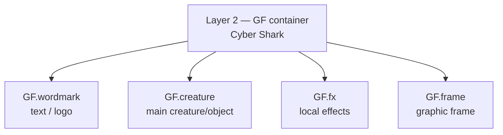

# PulseDeck — Layer Architecture (theory)

> Status: THEORY / DESIGN ONLY  
> Implementation starts only after an explicit user command such as «поїхали» or «погнали».

## Locked contract

**PulseDeck is LOCKED.**

Until explicitly unlocked:
- do not change the PulseDeck Z position;
- do not change positions of PulseDeck objects;
- do not change approved object offsets;
- do not rescale/recompose the approved PulseDeck;
- the small **PulseDeck Spectrum** remains part of the locked PulseDeck.

PULSEDECK_CENTER_CALIBRATION remains immutable.

## 1. Before — conceptual stack before the new separation



Problem: visually different systems were treated as one mixed middle region.

## 2. After — proposed target hierarchy

Higher layer number = closer to the user.



### Layer responsibilities

| Layer | System | Role |
|---:|---|---|
| 0 | Visualizer | Absolute bottom canvas. Full-screen music-reactive visualizations. |
| 1 | Big Equalizer | Second equalizer: large colored rounded bars. Independent from PulseDeck Spectrum and SPECTRUM_BARS visualizer mode. |
| 2 | GF — Graphic Figures | Graphic compositions such as Cyber Shark. A GF is a container, not necessarily one flat bitmap. |
| 3 | GIF / Animation | Independent GIF or other animated graphic assets. |
| 4 | Effects | Global particles, energy waves, glow and other atmospheric effects. |
| 5 | PulseDeck | Approved front UI/HUD. LOCKED. Includes the small PulseDeck Spectrum. |
| 6 | Service Overlay | Editing tools only; not part of final player composition. |

## 3. GF internal hierarchy

GF is a composition container with independently controllable sublayers.



Future GF behavior: hide/show whole GF or sublayers; animate creature independently; replace local FX; move/scale the GF as one container while preserving internal relative positions.

## 4. Naming distinction

```text
PulseDeck Spectrum = small spectrum inside locked PulseDeck = Layer 5
Big Equalizer      = large rounded colored bars             = Layer 1
SPECTRUM_BARS      = one Visualizer mode                    = Layer 0
```

They may react to the same audio signal, but they are separate render systems.

## 5. Intended visibility combinations

```text
FULL:              Visualizer + Big EQ + GF + GIF + Effects + PulseDeck
VISUALIZER ONLY:   Visualizer
VISUALIZER + EQ:   Visualizer + Big Equalizer
SCENE WITHOUT HUD: Visualizer + Big EQ + GF + GIF + Effects
PULSEDECK ONLY:    PulseDeck
CUSTOM:            Any allowed combination of Layers 0–5
```

Service Overlay remains an editor/developer layer rather than a normal presentation layer.

## 6. Core rule

**Z-order and content are separate concepts.** A layer number defines depth only. Content can change without moving other layers.

```text
TOP
6  Service Overlay
5  PulseDeck HUD 🔒 LOCKED
4  Effects
3  GIF / Animation
2  GF / Graphic Figures
1  Big Equalizer
0  Visualizer
BOTTOM
```

No rendering implementation is authorized by this document alone. It records the agreed theory for review before coding.
