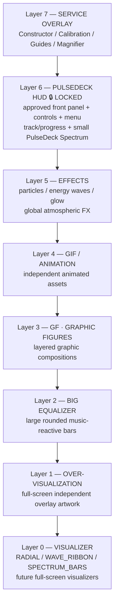

# PulseDeck — Layer Architecture

> Status: IMPLEMENTED / CURRENT CONTRACT
>
> Higher layer number = closer to the user.

## Locked contract

**PulseDeck is LOCKED.**

Until explicitly unlocked:
- do not change the PulseDeck Z position;
- do not change approved PulseDeck object positions or offsets;
- do not rescale/recompose the approved PulseDeck;
- the small **PulseDeck Spectrum** remains part of the locked PulseDeck;
- `PULSEDECK_CENTER_CALIBRATION` remains immutable.

## Canonical stack



### Layer responsibilities

| Layer | System | Role |
|---:|---|---|
| 0 | Visualizer | Absolute bottom canvas. Full-screen music-reactive visualizations. Independently toggleable. |
| 1 | Надвізуалізація / Over-visualization | Independent full-screen artwork above Visualizer. Current artwork: `447504`, stored as `skin/pulsedeck_hud/over_visualization/over_visualization_447504.webp`. Independently toggleable. |
| 2 | Big Equalizer | Large colored rounded bars. Independent from PulseDeck Spectrum and Visualizer `SPECTRUM_BARS`. |
| 3 | GF — Graphic Figures | Layered graphic compositions such as Cyber Shark. |
| 4 | GIF / Animation | Independent GIF or other animated graphic assets. |
| 5 | Effects | Global particles, energy waves, glow and other atmospheric effects. |
| 6 | PulseDeck | Approved front UI/HUD. **LOCKED and always visible.** Includes the small PulseDeck Spectrum. |
| 7 | Service Overlay | Editing/service tools only; not part of final presentation. |

## Layer 1 current renderer contract

The current `OverVisualizationView`:
- loads `pulsedeck_hud/over_visualization/over_visualization_447504.webp` from the repository-level `skin/` Android assets source;
- renders full-screen;
- uses center-crop;
- applies 5% overscan per edge (110% total width/height target);
- uses SCREEN blending so dark areas reveal Layer 0 below;
- is controlled independently from Layer 0 by persistent layer visibility state.

Layer 0 and Layer 1 must never be coupled: either can be enabled while the other is disabled.

## GF internal hierarchy

GF is a composition container with independently controllable sublayers.


## Naming distinction

```text
PulseDeck Spectrum = small spectrum inside locked PulseDeck = Layer 6
Big Equalizer      = large rounded colored bars             = Layer 2
SPECTRUM_BARS      = one Visualizer mode                    = Layer 0
Надвізуалізація    = independent full-screen overlay        = Layer 1
```

## Intended visibility combinations

```text
VISUALIZER ONLY:       Layer 0
VISUALIZER + OVER:     Layer 0 + Layer 1
FULL:                  Layers 0–6
SCENE WITHOUT HUD:     Layers 0–5
PULSEDECK ONLY:        Layer 6
CUSTOM:                Any allowed combination of Layers 0–5
```

Layer 6 stays locked/visible. Layer 7 is a service/editor slot.

## Core rule

**Z-order and content are separate concepts. A layer number defines depth only.**

```text
TOP
7  Service Overlay
6  PulseDeck HUD 🔒 LOCKED
5  Effects
4  GIF / Animation
3  GF / Graphic Figures
2  Big Equalizer
1  Надвізуалізація
0  Visualizer
BOTTOM
```

This is the current implementation contract and must be kept in sync with `PulseDeckLayerStack`, layer visibility controls, presets, and release documentation.
