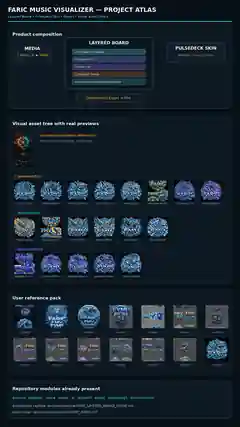
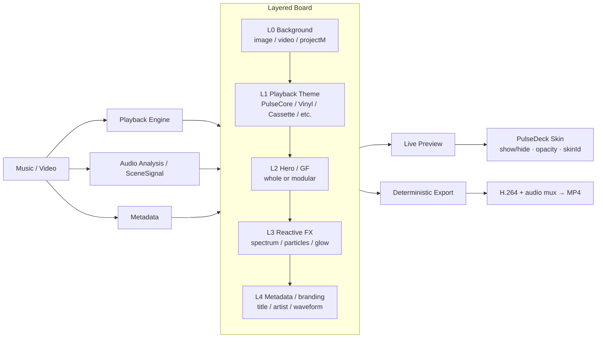
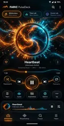
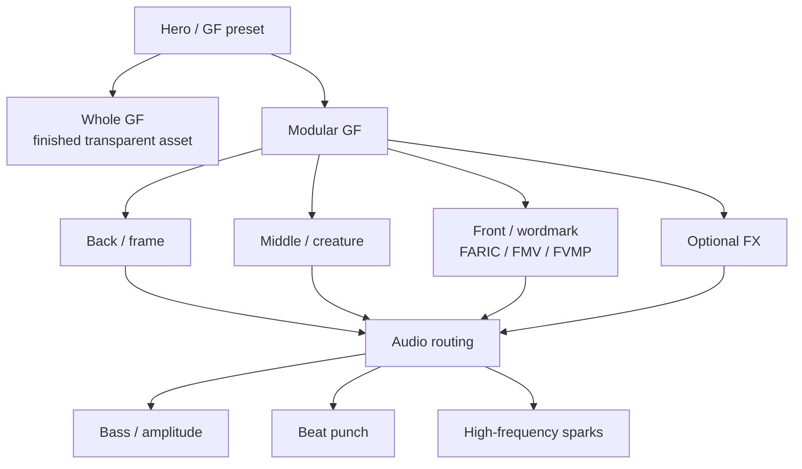

# FARIC Project Atlas

Captured: 2026-09-30

This is the visual map of the current FARIC Music Visualizer / PulseDeck direction. It complements the older release/history documents instead of replacing them.



## 1. Product composition



The **Board** is the exportable visual composition.  
The **PulseDeck Skin** is the live control plane above it and is not baked into export by default.

## 2. Repository tree — major areas

```text
faric-music-visualizer/
├── app/src/main/java/com/saney/musicvisualizer/
│   ├── analysis/       audio features / SceneSignal
│   ├── playback/       media transport / playback state
│   ├── scene/          scene specs / orchestration
│   ├── theme/          PlaybackTheme / HeroTheme
│   ├── ui/             live player / visualizer UI
│   ├── projectm/       projectM background integration
│   └── export/         offline analysis / H.264 / audio mux
├── docs/
│   ├── architecture/
│   │   ├── ARCHITECTURE.md
│   │   └── FARIC_LAYERED_BOARD_VISION.md
│   ├── design/pulsedeck/
│   │   ├── prototypes/PULSEDECK_SKIN_V1.svg
│   │   └── references/PULSEDECK_UI_REFERENCE_332780.webp
│   ├── visualizer/
│   │   ├── PLAYBACK_THEME_EXPORT_RESEARCH.md
│   │   ├── LOGO_GF_REFERENCE_PACK.md
│   │   └── assets/
│   │       ├── ASSET_INDEX.md
│   │       └── catalogs/
│   │           ├── USER_GF_REFERENCE_CONTACT_SHEET.webp
│   │           └── GENERATED_GF_CATALOG.webp
│   └── diagrams/
│       ├── FARIC_PROJECT_ATLAS.md
│       └── FARIC_PROJECT_ATLAS_PREVIEW.webp
└── ACTIVE_PLAN.md / CURRENT_HANDOFF.md / START_HERE_ASSISTANT.md
```

## 3. PulseDeck UI baseline



Canonical editable baseline:
`docs/design/pulsedeck/prototypes/PULSEDECK_SKIN_V1.svg`

The prototype remains immutable historical design evidence. A major redesign becomes V2 rather than silently replacing V1.

## 4. Real visual-reference catalogs

### User GF / logo references


Logical source set recorded in `docs/visualizer/assets/ASSET_INDEX.md`:
`333062, 333063, 333064, 333065, 333066, 333069, 333070, 333071, 333072, 333074, 333075, 333076, 333077, 333096`.

### Generated FARIC / FMV / FVMP concepts


Current explored Hero/GF family includes:
- FARIC: Cyber Shark, Cyber Panther, Mecha Tiger, Void Dragon, modular serpent/dragon set;
- FMV: Neon Griffin, Thunder Wolf, Razor Raven, Inferno Phoenix, modular griffin set;
- FVMP: Plasma Cobra, Titan Scorpion, void/cosmic serpent set.

These committed catalog images are repository-sized visual indexes. Full production assets should later be exported individually at the required resolution/transparency.

## 5. Hero / GF production model



## 6. Skin block model

Initial configurable-block contract:

```text
visible: true / false
opacity: 0..1
skinId: selected block skin
```

Candidate blocks:
- top header / FARIC branding;
- Library / Tone Lab / Scene Lab shortcuts;
- seek/progress;
- transport controls;
- Scene / EQ / Effects quick actions;
- PulseDock mini-player;
- bottom navigation.

Later the same model can expand to position, scale, spacing and saved skin presets without changing the Board concept.

## 7. Preview / export parity

Hard direction:

> The same saved Board/project description should drive live preview and deterministic export at the same project time.

The PulseDeck Skin is a separate UI plane unless a future block is explicitly marked exportable.
