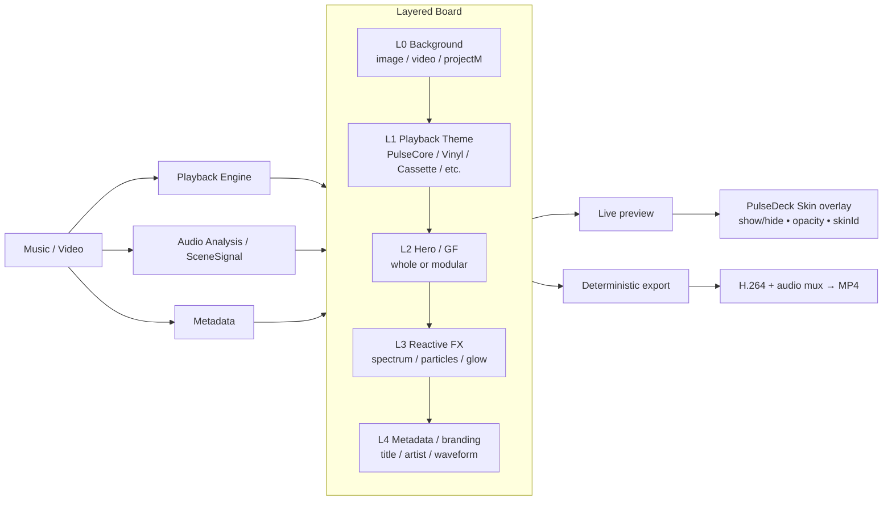
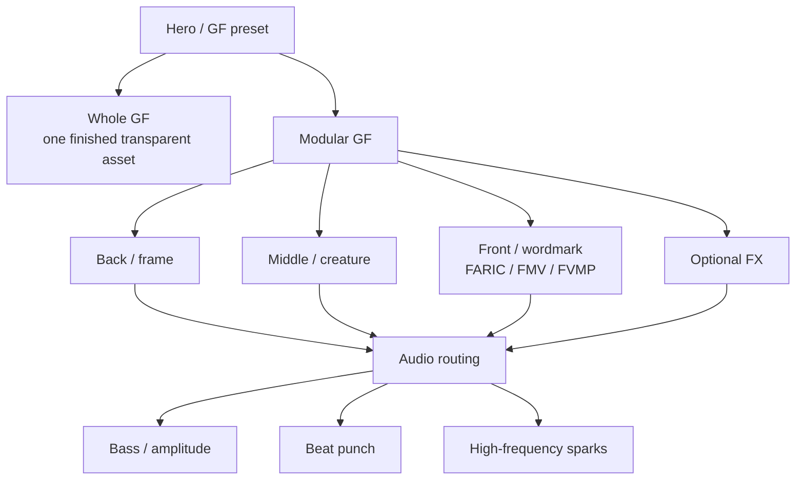

# FARIC Project Atlas

Captured: 2026-09-30

This page is the visual map of the current project direction. It combines the current repository modules, the new Layered Board model, the accepted PulseDeck skin direction, user references and generated Hero/GF concepts.

## 1. Product composition



The **Board** is the visual composition. The **PulseDeck Skin** is the live control overlay above the Board and is not baked into export by default.

## 2. Repository tree — current major areas

```text
faric-music-visualizer/
├── app/src/main/java/com/saney/musicvisualizer/
│   ├── analysis/       audio feature extraction / SceneSignal
│   ├── playback/       transport and playback state
│   ├── scene/          scene specs and orchestration
│   ├── theme/          PlaybackTheme / HeroTheme rendering
│   ├── ui/             player and visualizer views
│   ├── projectm/       projectM background integration
│   └── export/         offline analysis / H.264 / AAC / mux proof
├── docs/
│   ├── architecture/
│   │   ├── ARCHITECTURE.md
│   │   └── FARIC_LAYERED_BOARD_VISION.md
│   ├── design/pulsedeck/
│   │   ├── prototypes/PULSEDECK_SKIN_V1.svg
│   │   └── references/PULSEDECK_UI_REFERENCE_332780.webp
│   ├── visualizer/
│   │   ├── PLAYBACK_THEME_EXPORT_RESEARCH.md
│   │   ├── LOGO_GF_REFERENCE_PACK.md
│   │   └── assets/
│   │       ├── references/user/
│   │       ├── generated/faric/
│   │       ├── generated/fmv/
│   │       └── generated/fvmp/
│   └── diagrams/FARIC_PROJECT_ATLAS.md
└── ACTIVE_PLAN.md / CURRENT_HANDOFF.md / START_HERE_ASSISTANT.md
```

## 3. Accepted PulseDeck UI reference


Canonical editable baseline: `docs/design/pulsedeck/prototypes/PULSEDECK_SKIN_V1.svg`.

## 4. Generated Hero / GF concepts

### FARIC

| Preview | Preview | Preview | Preview |
| --- | --- | --- | --- |
|  |  |  |  |
| `cyber-panther-v1` | `cyber-panther-v2` | `cyber-shark-v1` | `cyber-shark-v2` |
|  |  |  |  |
| `mecha-tiger` | `modular-set-v1` | `void-dragon-v1` | `void-dragon-v2` |

### FMV

| Preview | Preview | Preview | Preview |
| --- | --- | --- | --- |
|  |  |  |  |
| `inferno-phoenix` | `modular-set-v1` | `neon-griffin-v1` | `neon-griffin-v2` |
|  |  |  |  |
| `razor-raven` | `thunder-wolf` |  |  |

### FVMP

| Preview | Preview | Preview | Preview |
| --- | --- | --- | --- |
|  |  |  |  |
| `modular-set-v1` | `plasma-cobra-alt` | `plasma-cobra-v1` | `plasma-cobra-v2` |
|  |  |  |  |
| `titan-scorpion` |  |  |  |

## 5. User GF / logo references

| Preview | Preview | Preview | Preview |
| --- | --- | --- | --- |
|  |  |  |  |
| `333062` | `333063` | `333064` | `333065` |
|  |  |  |  |
| `333066` | `333069` | `333070` | `333071` |
|  |  |  |  |
| `333072` | `333074` | `333075` | `333076` |
|  |  |  |  |
| `333077` | `333096` |  |  |

## 6. Hero/GF production model



## 7. Skin-block model

Minimum configuration contract:

```text
visible: true / false
opacity: 0..1
skinId: selected block skin
```

Examples of configurable blocks:
- top header / FARIC branding;
- Library / Tone Lab / Scene Lab shortcuts;
- seek/progress;
- transport controls;
- Scene / EQ / Effects quick actions;
- PulseDock mini-player;
- bottom navigation.

## 8. Preview/export parity

The same saved Board/project description should drive both live preview and deterministic export. The live PulseDeck Skin is a separate UI plane.
