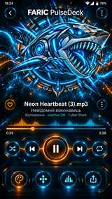
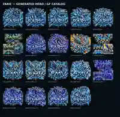
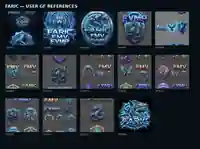

# FARIC MUSIC VISUALIZER

## Посібник користувача

**Версія застосунку:** v0.19.43 · build 132  
**Оновлення посібника:** 08.10.2026  
**Мова:** українська  
**Призначення:** практична інструкція до фактично доступних функцій Android-застосунку.

FARIC поєднує локальне відтворення музики, живу візуалізацію, багатошарову сцену Board, налаштування проєкту та створення відео MP4. Можна прослуховувати трек, спостерігати, як реагує сцена, змінювати її складові й експортувати результат.

> **Статус версії.** Цей документ описує v0.19.43, для якої Android-збірка пройшла CI. Окремі зміни ще очікують перевірки на телефоні. Деякі кнопки інтерфейсу є планами на майбутнє — вони спеціально позначені нижче. Скриншоти взяті з тестування близьких версій і можуть трохи відрізнятися.

> **Перевірка переходів (08.10.2026).** На v0.19.43 користувач підтвердив: короткий експорт, копіювання статистики без закриття звіту та кнопка OK — **PASS (3/3)**. Переходи «плеєр ↔ projectM» та «плеєр ↔ Board» — **FAIL (2/2)** через видимі паузи/перебудову візуалізації. У **v0.19.44 / build 133** Android CI пройшло, проте на телефоні **обидва способи повернення з projectM дали FAIL**; Board не перевірявся, 3-секундний MP4 — PASS (5789 мс). Наступний **v0.19.45 / build 134** — лише код-кандидат захисту GL-потоку при виході, до телефонного підтвердження переходи залишаються проблемними. Інші функції цього посібника залишаються без змін.

## Зміна архітектури екранів — кандидат v0.19.46 / build 135

У коді-кандидаті меню Board, проєктM authoring і перегляд Playback Themes відкриваються поверх одного плеєра, замість постійного створення нової сцени. Для звичайного відкриття projectM з уже встановленою бібліотекою окрема Activity не запускається: фон залишається у старому GL-view; доступні TOP/ALL/NEXT/FG/BG/CENTER/EDGE, AUTO і ⚙ FG. Первинне встановлення бібліотеки лишається у старому майстрі. Android #607 для v0.19.46 / build 135 пройшов, новий код у main. **Phone QA ще не виконано**, тому плавність переходів поки не підтверджена. Старе пояснення меню для v0.19.43 лишається історичним, а нова поведінка активується лише після прийняття й встановлення build 135.

## Зміст — куди перейти

1. Швидкий початок — від файлу до відео
2. Карта інтерфейсу й терміни
3. Головна сторінка та вибір музики
4. Плеєр: слухання й керування
5. Playback Themes: зміна сцени
6. Шари та об'єкти: що ввімкнено
7. Board: налаштування героїв і деталей
8. projectM: фон, Center, Edge FX та AUTO
9. Composition Sets: збереження оформлення
10. Export Lab: аналіз, PNG, MP4
11. Налаштування інтерфейсу та службові інструменти
12. Практичні приклади
13. Типові проблеми та обмеження
14. Словник термінів
15. Що заплановано, але ще не готове
16. Як оновлюватиметься цей посібник

## 1. Швидкий початок

**Мета:** відкрити пісню, вибрати вигляд сцени та створити пробне відео.

1. Запусти FARIC. На стартовій сторінці натисни **«＋ Обрати музику»**.
2. У системному вікні Android вибери локальний аудіофайл. FARIC відкриє плеєр із вибраним треком.
3. Перевір **▶ / ⏸**, повзунок прогресу та звук. Натисни **Theme**, щоб перейти до **Playback Themes**.
4. Обери доступну тему (наприклад, **Cyber Shark**, **Cyber Panther** або FARIC/projectM) і повернися до плеєра.
5. За потреби відкрий **Board**, щоб змінити положення, розмір, обертання чи прозорість зображення.
6. Для фону projectM відкрий **Visualizer** і налаштуй фон/передній план. Повернися до плеєра.
7. Відкрий **Export** → **Проаналізувати трек офлайн** → вибери формат **9:16** → **«Тест · експортувати 3 с MP4»**.
8. Після завершення перевір результат у **Movies/FARIC**. Для кадру PNG передбачено **Pictures/FARIC**.

**Не починай із довгої пісні:** у цій версії зафіксовано аварійне закриття під час одного повного експорту приблизно на 48%; причину ще досліджують. Спочатку використовуй 3-секундний тест.

## 2. Як організовано FARIC

| Частина | Для чого потрібна | Де шукати |
|---|---|---|
| **Бібліотека** | Вибрати локальний аудіофайл і перейти до відтворення | Головний екран |
| **Плеєр / PulseDeck** | Пауза, відтворення, прогрес, керування сценою | Екран композиції |
| **Playback Themes** | Вибрати готову візуальну тему | Кнопка **Theme** |
| **Board** | Редагувати розміщення графічного комплекту та його шарів | Кнопка **Board** |
| **Visualizer / projectM** | Перемикати пресети фону й налаштовувати Center / Edge FX | Кнопка **Visualizer** |
| **Шари / Layers** | Увімкнути або вимкнути частини композиції та окремі об'єкти | Меню **⋮ → Шари / Layers** |
| **Composition Sets** | Зберегти й повторно завантажити набір параметрів сцени | **⋮ → Сети / Sets** |
| **Export Lab** | Аналіз звуку, вибір кадру, PNG та MP4 | Кнопка **Export** |

*Візуальний референс PulseDeck з репозиторію. Це ілюстрація стилю, а не гарантований вигляд поточної APK.*

**Board ≠ PulseDeck.** Board — це саме візуальна композиція, а PulseDeck — інтерфейс керування поверх неї. В експорті формується композиція, а не просто запис усього Android-екрана.

**Важлива плутанина назв.** У поточному інтерфейсі **GF / Graphic Figures** — це комплекти героїв **Cyber Shark / Cyber Panther** (фон, Frame, Creature, Wordmark, FX). У майбутньому ці набори планується називати «Герої», а нові процедурні музичні фігури — «Аудіоформи». Сьогодні не шукай окремий готовий каталог аудіоформ.

## 3. Головний екран та вибір музики

На головному екрані FARIC відображаються назва застосунку, версія/build, блок «Твоя музика. Твоя сцена», кнопка **«＋ Обрати музику»**, плитки Library Worlds, нижній мініплеєр і навігація.

**Як відкрити файл:** натисни «＋ Обрати музику» → обери трек у системному файловому вікні Android. Це основний робочий спосіб вибору музики у v0.19.43.

**Що поки не працює як повноцінна медіатека:** «Усі треки», «Теки», «Альбоми», «Виконавці», «Жанри», «Роки», «Улюблені», «Нещодавні» — наразі плитки-заготовки до появи локального медіасканера. Окремі кнопки «Пошук», «Черга», «Tone Lab» також показують повідомлення про майбутню реалізацію. Не плутай їх із готовими інструментами.

**Scene Lab** на стартовій сторінці веде до вибору візуальної теми. На навігаційній панелі «Візуалізатор» відкриває плеєр, якщо трек уже вибрано.

## 4. Плеєр PulseDeck

У плеєрі видно саму композицію, назву треку, час, хвильову форму/прогрес і кнопки керування. Інтерфейс використовує темну основу, неонові помаранчеві та блакитні акценти.

| Керування | Що відбувається |
|---|---|
| **▶ / ⏸** | Відтворити або призупинити трек |
| **⏮ / ⏭** | Попередній / наступний елемент черги (фактичний склад черги залежить від завантажених файлів) |
| **Shuffle** | Перемкнути випадковий порядок, якщо є відповідна черга |
| **Repeat** | Увімкнути/вимкнути повтор одного треку |
| **Шкала прогресу** | Перейти до потрібного моменту пісні |
| **Theme** | Обрати іншу Playback Theme |
| **Board** | Редагувати сцену/графічні об'єкти |
| **Visualizer** | Перейти на окремий екран projectM |
| **Export** | Відкрити Export Lab |
| **⋮ / Menu** | Шари, сети, конструктори, автоприховування |
| **← Back** | Повернутися до бібліотеки |

**Подвійний дотик** на області плеєра перемикає видимість елементів керування. У меню **⋮ → Автоприховування** доступні варіанти: «Не ховати», «Ховати тільки керування», «Ховати керування + нижню панель».

Кнопки «Обране» та «Дії треку» у цій версії поки повідомляють, що функції з'являться пізніше.

## 5. Playback Themes — вибрати вигляд

**Маршрут:** плеєр → **Theme** → **Playback Themes**.

Перелік містить теми із заголовком, описом і статусом. **Позначка «СКОРО»** означає, що тему показано в каталозі, але її ще не можна використати. Обраний активний елемент позначено **✓**.

Доступні типи включають **FARIC/projectM layered visualizer**, **Cyber Shark**, **Cyber Panther** та окремі реалізовані реактивні Hero Themes. У списку можуть бути й заплановані теми — не вибирай «СКОРО» для практичних інструкцій.

**Як змінити:** натисни на готову тему → застосунок запам'ятає вибір і поверне до плеєра. Якщо ти вибрав комплект із шарами, його деталі згодом налаштовують у **Board**.

*Концепти графічних оформлень із каталогу проєкту. У застосунку доступні лише теми без позначки «СКОРО».*

## 6. Шари / Layers — склад композиції

**Маршрут:** плеєр → **⋮ → Шари / Layers**. Це перетягувана панель **«Шари та об'єкти»**.

На панелі можна вмикати/вимикати шари й підоб'єкти за допомогою прапорців. Зміни видно на сцені. Стан окремих об'єктів також має власні залежності: вимкнений батьківський шар приховує підоб'єкти.

| Шар у меню | Значення |
|---|---|
| **Visualizer** | Основний фон projectM, FG Center та FG Edge FX |
| **Надвізуалізація** | Додатковий оверлей поверх візуалізації |
| **Big Equalizer** | Великий аудіоіндикатор |
| **GF / Graphic Figures** | Поточний графічний комплект: акула/пантера, його підшари |
| **GIF / Animation** | Зарезервований окремий шар; може бути порожнім |
| **Effects** | Ефекти композиції |
| **PulseDeck 🔒** | Системно захищений шар керування; не вимикається тут |
| **Service Overlay** | Службовий шар, не призначений для звичайного редагування |

Навпроти **GF** можна вибирати графічний комплект, а через **⚙** перейти до редактора його деталей. Біля **Visualizer → ⚙** відкривається плаваюча панель projectM із параметрами Center / Edge. Панель можна відтягнути, щоб вона не закривала результат.

Панель Layers також містить **експорт конфігурації шарів JSON** і команду повернення панелі в центр. JSON — технічний файл параметрів, не MP4 і не аудіофайл.

## 7. Board — редагування композиції та героя

**Маршрут:** плеєр → **Board** або **⋮ → Шари / Layers → GF → ⚙**.

Board показує саму композицію, щоб ти бачив результат змін одразу. Внизу розміщена панель **«Редагувати»**, яку можна прокручувати. Зліва вгорі — кнопка повернення на головний плеєр.

**Вкладки Board:**

- **Усе** — змінювати весь комплект разом (положення, розмір, обертання, прозорість).
- **BG/Glow** — фон, світіння і декоративна підкладка героя.
- **Frame** — рамка героя.
- **Shark / Panther** — головний персонаж (Creature).
- **FARIC** — напис / Wordmark.
- **FX** — окремі ефекти комплекту (якщо є в поточному наборі).

**Жести:** при виборі «Усе» один палець переміщує комплект; жест двома пальцями змінює масштаб і поворот. Якщо вибраний окремий підшар, жести діють тільки на нього. Музична реакція при редагуванні не вимикається.

**Налаштування всього GF:** X, Y, розмір, поворот, прозорість; також реакції на музику, включно з плавним поворотом, Stereo L/R і вертикальною реакцією на Bass. Є **Fit Safe Area** і **Reset усе**. Остання команда скидає налаштування всього комплекту, тому перед експериментами краще зберегти Composition Set.

**Налаштування окремого шару:** Зсув X / Y, Розмір шару, Поворот шару, Прозорість шару. Для **Frame** також доступне **«Автообертання Frame»**: від −180 до +180°/с, де **0°/с** означає відсутність безперервного автообертання, **+** та **−** задають різні напрямки. Статичний кут «Поворот шару» не скидається від зміни швидкості. Реакція на удари може залишатися навіть за 0°/с.

**Приклад:** вистави Frame на 60°, швидкість +30°/с; перевір, що повертається рамка, а персонаж не обертається разом із нею. Потім −30°/с, потім 0°/с. Зміни зберігаються для вибраного комплекту, а також у Composition Set.

*Ілюстрація 1. Каталог референсів героїв; реальні знімки екрана Board дивіться у PDF/DOCX версіях посібника.*

## 8. projectM — налаштувати візуалізацію

**Маршрут:** плеєр → **Visualizer**. Окремий екран projectM призначено для вибору й попереднього перегляду фону та передніх ефектів. Зліва вгорі є кнопка повернення в плеєр.

У нижніх рядах є кнопки **ТОП**, **ВСІ**, **NEXT**, **FG**, прапорці **BG / CENTER / EDGE FX**, **AUTO OFF**, **⚙ FG**. Угорі відображаються режим, кількість пресетів, назва обраного пресету, стан фону й FG. Позначення **PRELOAD** стосується попереднього завантаження пресетів.

| Кнопка | Дія |
|---|---|
| **ТОП / ВСІ** | Перемикати набір доступних пресетів |
| **NEXT** | Перейти до наступного пресету |
| **FG** | Перемикати передній приклад/ефект |
| **BG** | Показати/сховати фон projectM |
| **CENTER** | Показати/сховати центральний передній ефект |
| **EDGE FX** | Показати/сховати крайові ефекти |
| **AUTO OFF / AUTO Ns** | Увімкнути/вимкнути автоматичну зміну пресетів у попередньому перегляді |
| **⚙ FG** | Відкрити плаваючу панель AUTO / CENTER / EDGE FX |

**AUTO 5/10/15 секунд:** у режимі попереднього перегляду пресети можуть змінюватися з таким інтервалом. **У фінальному MP4 автоматична послідовність за цим інтервалом поки не гарантується:** автоматичне керування Export ще у планах.

**Панель ⚙ FG:** вкладки **AUTO**, **CENTER**, **EDGE FX**. Перетягни панель пальцем убік для огляду сцени. Позиція запам'ятовується. **CENTER** дозволяє змінювати масштаб, статичний поворот, прозорість, чутливість Bass / Mid / High / Beat, а також **автообертання в градусах за секунду**. **EDGE FX** має свою прозорість і реакції на музику.

**Точкове скидання:** натисни просто на **число між − та +**, щоб повернути тільки цей параметр до стандартного значення. Загальні кнопки «Скинути Center / Edge FX» скидають цілу групу.

*Ілюстрація 2. Приклад живої панелі ⚙ FG наведено у PDF/DOCX; у вихідному Markdown поки не зберігається окремий знімок користувача.*

*Ілюстрація 3. Реальний екран projectM із ТОП/ВСІ/NEXT/FG/AUTO зображений у PDF/DOCX; майбутня GitHub-версія доповниться окремим фотоекраном.*

## 9. Composition Sets — зберігай свої варіанти

**Маршрут:** плеєр → **⋮ → Сети / Sets**.

Тут можна створити іменований набір поточних налаштувань композиції, завантажити його, перезаписати, перейменувати або видалити.

**Перший сет:** налаштуй сцену → відкрий «Сети / Sets» → **«＋ Зберегти поточний як сет»** → введи назву, наприклад «Shark Neon 9:16» → «Зберегти». Для відновлення відкрий список і вибери **«Завантажити»**. Для зміни назви та видалення використовуй меню відповідного сету.

**Що зберігається:** конфігурація видимості й параметрів шарів, обраний графічний комплект, налаштування Board, projectM/FG, доступні параметри реакції та трансформацій. У v0.19.42+ зберігається швидкість обертання Frame. Це **набір оформлення**, а не копія аудіофайлу і не готовий MP4.

**Обережно:** «Перезаписати поточним» замінює параметри вибраного сету, а «Видалити» прибирає його зі списку. Перед великими змінами створи нову назву.

## 10. Export Lab — від сцени до файлу

**Маршрут:** плеєр → **Export** → **Export Lab**.

Експорт використовує обраний аудіофайл, налаштування сцени і результати офлайн-аналізу. Це окреме створення кадрів/відео, а не запис екрана з Android-кнопками.

**Крок 1. Offline analysis.** Якщо трек ще не проаналізований, натисни **«Проаналізувати трек офлайн»**; якщо аналіз уже є — **«Повторити offline analysis»**. Дочекайся завершення. Для іншого аудіофайлу аналіз потрібно виконати наново.

**Крок 2. Формат відео.** Обери співвідношення сторін:

| Формат | Де може знадобитися |
|---|---|
| **9:16 · TikTok / Shorts** | Вертикальні відео |
| **16:9 · YouTube** | Горизонтальні відео |
| **1:1 · Square** | Квадратне відео |
| **4:5 · Feed** | Вертикальна стрічка |

**Крок 3. Експорт.** Доступні **«Зберегти кадр композиції PNG»**, **«Тест · експортувати 3 с MP4»**, **«Експортувати всю пісню MP4»** (для тем із підтримуваним рендерером). Почни з тесту на 3 секунди: так перевіриш картинку, шари, співвідношення сторін і звук без тривалого очікування. Не всі теми мають готовий експортний рендерер; якщо кнопка недоступна — вибери підтримувану тему.

**Крок 4. Знайти файл.** Кнопка **«Відкрити папку експорту»** пропонує **Pictures/FARIC** для PNG і **Movies/FARIC** для MP4 зі звуком.

**Крок 5. Переглянути звіт.** Після успішного експорту з'являється **«Експорт завершено»** з розміром, кількістю кадрів і часом етапів (projectM, composition, encoder, audio, mux, save). У v0.19.43 довгий текст звіту прокручується окремо, **«Копіювати текст» залишає вікно відкритим**, а **«OK»** його закриває. Цю останню поведінку ще потрібно підтвердити на телефоні.

*Ілюстрація 4. Приклад вікна завершення експорту міститься у PDF/DOCX. Новий вигляд з фіксованими Copy/OK ще очікує контрольний скриншот.*

**Що означають цифри:** «total» — час виконання завдання, «90 кадрів» для 3 секунд при 30 кадрів/с, «encoder» — кодування відео, «mux» — об'єднання потоків, «save» — запис файла. Ці величини — показники продуктивності, а не налаштування якості.

## 11. Додаткові налаштування і конструктори

**⋮ → PulseDeck tools** відкриває:

- **Center Calibration** — службовий інструмент калібрування центрів UI. Це не звичайна кнопка налаштування обкладинки; використовуй лише за потреби.
- **Template Constructor** — конструктор шаблонів розміщення інтерфейсу (службовий/розширений розділ).
- **Object Constructor** — конструктор окремих UI-об'єктів (розширений розділ).
- **Шари / Layers** — звичайне керування шарами сцени.
- **Сети / Sets** — збереження композиції.
- **Автоприховування** — коли й які кнопки плеєра ховати.

**Не змінюй службові калібрування без потреби:** вони призначені для точного налаштування геометрії PulseDeck. Для творчої роботи з акулою, рамкою чи тлом використовуй Theme / Board / Visualizer / Layers.

## 12. Три практичні сценарії

### Сценарій A: змінити вигляд без експорту

«＋ Обрати музику» → **Theme → Cyber Shark** → **Board → Frame** (розмір / поворот / автообертання) → повернутися в плеєр. Для збереження варіанта: **⋮ → Сети / Sets → Зберегти**.

### Сценарій B: налаштувати тільки фон

Плеєр → **Visualizer** → **ТОП** або **ВСІ** → **NEXT** до потрібного пресету → **AUTO OFF** для ручної фіксації → **⚙ FG** → **CENTER / EDGE FX**. Якщо центральний елемент заважає, вимкни **CENTER**. Повернися до плеєра та дивися сумарну композицію.

### Сценарій C: підготувати коротке вертикальне відео

Обрати трек → вибрати Theme → Board/Visualizer → **Export → Offline analysis → 9:16 → Тест 3 с MP4** → відкрити **Movies/FARIC** → переглянути результат. Якщо він подобається, збережи сет і лише тоді плануй повний експорт, враховуючи наявну проблему стабільності.

## 13. Типові запитання та відомі обмеження

**Чому плитка «Альбоми» не відкриває альбоми?** Повний індекс локальної медіатеки ще не завершено. Користуйся «Обрати музику».

**Чому «AUTO 5s» працює на екрані projectM, а у MP4 не бачу циклу пресетів?** Автоматичне перемикання вже перевірялося у попередньому перегляді; детермінована послідовність перемикань для MP4 ще у розробці.

**Чому підвисає повернення між Board/плеєром/projectM?** Відоме відкрите питання життєвого циклу спільного GL-рендера (**PERF-NAV-002**). Кнопка «Назад» уже є, але паузи можуть залишатися.

**Що робити, якщо повний експорт закрив застосунок?** Відомий звіт про вихід приблизно на 48% (**BUG-EXPORT-001**). Не повторюй багато повних експортів поспіль. Збережи трек, параметри відео, приблизний відсоток і, якщо можливо, журнал збою для діагностики.

**У звіті експорту немає кнопок?** У v0.19.41+ довгий текст має прокручуватися окремо, а Copy/OK — залишатися видимими. У v0.19.43 Copy має не закривати вікно; це ще очікує телефонної перевірки.

**Як скинути тільки масштаб Center?** Відкрий **⚙ FG → CENTER** і натисни на число масштабу між «−» та «+». Для скидання всієї групи — спеціальна кнопка Reset.

**Чи всі Graphic Figures доступні як окремі герої?** Ні. Зараз каталог GF містить **Cyber Shark** та **Cyber Panther**. Решта персонажів і нові аудіоформи — плани, а не доступні набори.

## 14. Словник

| Назва | Простими словами |
|---|---|
| **projectM** | Рушій анімованих музичних пресетів фону |
| **Preset** | Готовий алгоритм / стиль руху projectM |
| **FG Center** | Центральний передній ефект, який можна масштабувати й обертати |
| **FG Edge FX** | Ефекти по краях сцени |
| **GF / Graphic Figure** | Поточна технічна назва набору героя (акула/пантера) |
| **Hero / Герой** | Майбутня зрозуміла назва персонажного набору |
| **Frame** | Рамка довкола героя; окремий шар |
| **Creature** | Сам персонаж (акула, пантера) |
| **Wordmark** | Логотип / текст поверх персонажа |
| **Board** | Полотно композиції з декількох шарів |
| **PulseDeck Skin** | Видимі кнопки й інтерфейс плеєра |
| **Composition Set** | Іменоване збереження параметрів оформлення |
| **Offline analysis** | Підготовка інформації про музику для генерації відео |
| **GPU direct** | Шлях формування частини відео за допомогою GPU |
| **Audioform / Аудіоформа** | Запланований окремий тип геометрії, що змінюється від басів/бітів |

## 15. Що заплановано

Ці пункти **не слід сприймати як реалізовані можливості** у v0.19.43:

- повна музична бібліотека з індексацією треків, папок, альбомів, виконавців, жанрів, років, пошуком і чергою;
- повноцінний **Tone Lab / EQ** як завершений користувацький розділ;
- майбутня категорія **Аудіоформи** (музичні кола, деформовані кільця, спектральні фігури);
- нові герої (окрім наявних Cyber Shark / Cyber Panther);
- детерміноване автоматичне перемикання projectM пресетів кожні 5/10/15 секунд у MP4;
- додаткова оптимізація переходів і стабільності повного експорту.

## 16. Як оновлюється інструкція

Канонічна документація зберігається в репозиторії **faric-ua/faric-music-visualizer**, каталог **docs/user/**. Після релізів оновлюються: версія, фактично доступні функції, підписи UI, приклади екранів і відомі проблеми. PDF і DOCX — підготовлені копії посібника для читання та редагування; PDF/DOCX цього випуску містять реальні тестові знімки екрана, на відміну від текстового GitHub-джерела.

**Зміни редакцій:**

| Дата | Редакція | Зміст |
|---|---|---|
| 08.10.2026 | 1.0 / v0.19.43 | Перша структурована інструкція; реальні функції vs плани, 4 приклади екранів |

**Джерела для підтримки інструкції:** 
- `app/src/main/java/com/saney/musicvisualizer/MainActivity.kt`
- `app/src/main/java/com/saney/musicvisualizer/projectm/ProjectMActivity.kt`
- `docs/architecture/FARIC_LAYERED_BOARD_VISION.md`
- `docs/visualizer/PROJECTM_AUTHORING_WORKFLOW.md`
- `docs/architecture/VISUAL_ELEMENTS_TAXONOMY.md`
- `docs/checkpoints/2026-10-08-v0.19.43-export-copy-lifecycle.md`

**FARIC Music Visualizer — створюй власну сцену під музику.**