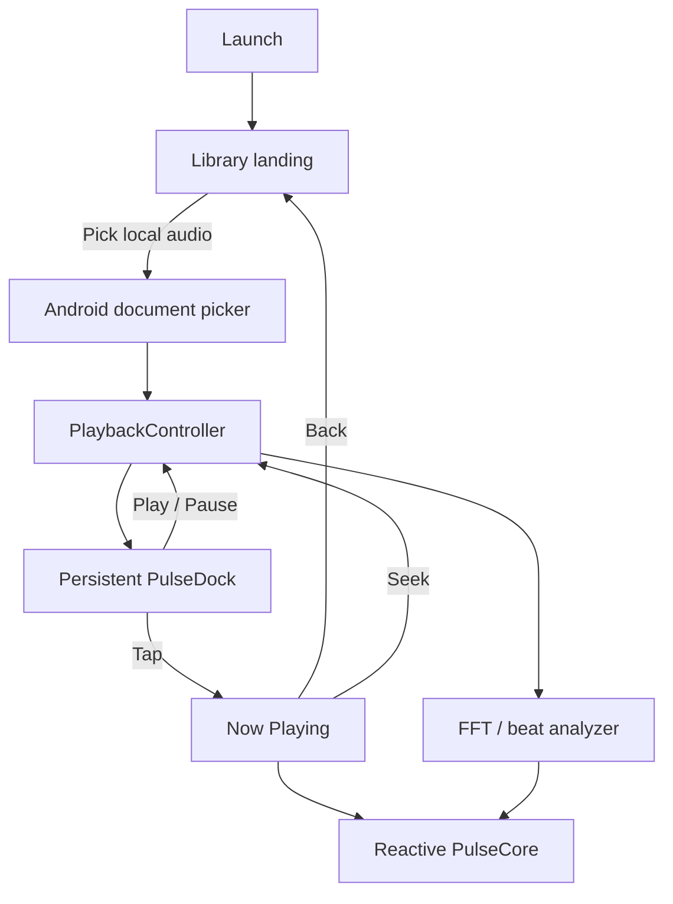

# PulseDeck v0.2.0 Flow

```mermaid
flowchart TD
    Launch[Launch] --> Library[Library landing]
    Library -->|Pick local audio| Picker[Android document picker]
    Picker --> Playback[PlaybackController]
    Playback --> Dock[Persistent PulseDock]
    Dock -->|Tap| NowPlaying[Now Playing]
    NowPlaying --> PulseCore[Reactive PulseCore]
    Playback --> Analyzer[FFT / beat analyzer]
    Analyzer --> PulseCore
    NowPlaying -->|Back| Library
    NowPlaying -->|Seek| Playback
    Dock -->|Play / Pause| Playback
```

Future Library Worlds and YTM backend are intentionally outside this release.
