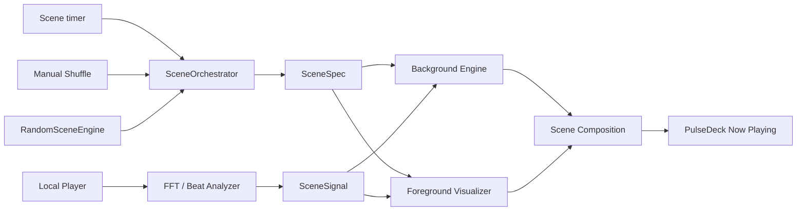

# Random Visualizer Core

```mermaid
flowchart LR
    Player[Local Player] --> Analyzer[FFT / Beat Analyzer]
    Analyzer --> Signal[SceneSignal]

    Timer[Scene timer] --> Orchestrator[SceneOrchestrator]
    Shuffle[Manual Shuffle] --> Orchestrator
    Random[RandomSceneEngine] --> Orchestrator

    Orchestrator --> Spec[SceneSpec]
    Spec --> Foreground[Foreground Visualizer]
    Spec --> Background[Background Engine]

    Signal --> Foreground
    Signal --> Background

    Background --> Compose[Scene Composition]
    Foreground --> Compose
    Compose --> Screen[PulseDeck Now Playing]
```
